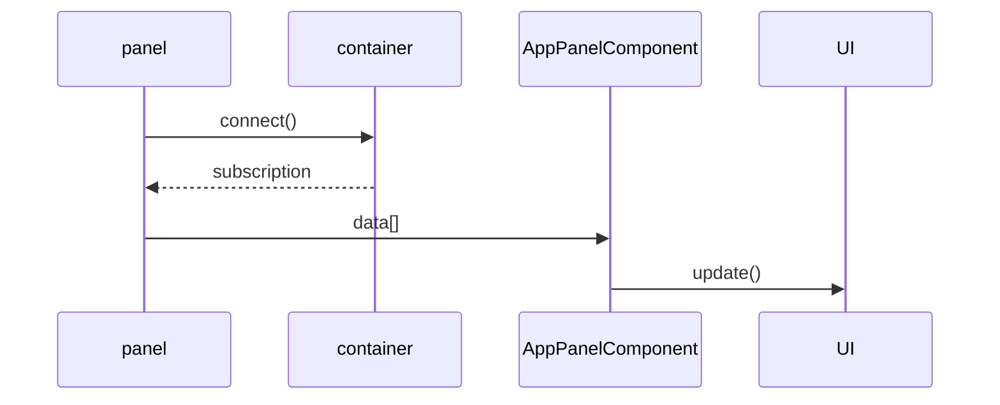

# ASYNCHRONOUS DATA REFRESH

This new data management model will have the next elements and connections:

The data processing will start by subcribing to on or more data providers. The code inside the usbcription will update the UI model with the use of the core method *completeDowload()*
